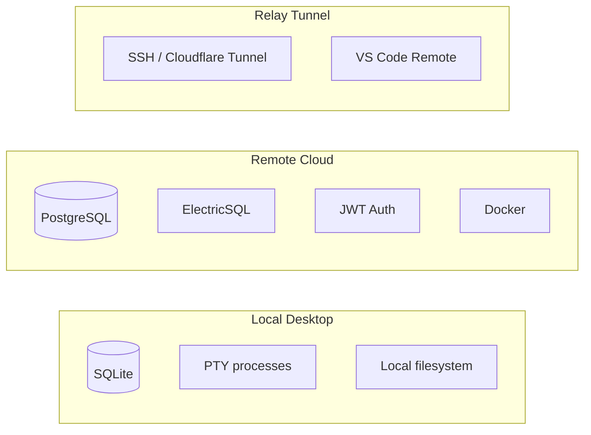

# Architecture Overview

## System Diagram

```mermaid
graph TB
    subgraph "Frontend (React/TypeScript)"
        LOCAL_WEB["local-web<br/>Vite + TanStack Router"]
        REMOTE_WEB["remote-web<br/>ElectricSQL sync"]
        WEB_CORE["web-core<br/>Shared features/hooks/stores"]
        UI_LIB["@vibe/ui<br/>143 Shadcn-style components"]
        LOCAL_WEB --> WEB_CORE
        REMOTE_WEB --> WEB_CORE
        WEB_CORE --> UI_LIB
    end

    subgraph "Axum Server (Rust)"
        MAIN_SERVER["Main Server<br/>API + WebSocket"]
        PREVIEW["Preview Proxy<br/>Workspace previews"]
        ROUTES["Routes<br/>REST + WS + SSE"]
        MW["Middleware<br/>Origin, Relay Signing, CORS"]
        MAIN_SERVER --> ROUTES
        MAIN_SERVER --> MW
    end

    subgraph "Services Layer"
        CONTAINER["ContainerService<br/>Execution lifecycle"]
        WORKTREE["WorktreeManager<br/>Git worktree isolation"]
        EVENTS["EventService<br/>SSE broadcasting"]
        FILESYSTEM["FilesystemService<br/>File ops + watcher"]
        PR_MON["PrMonitorService<br/>PR tracking"]
        REPO["RepoService<br/>Repo registration"]
        REMOTE_CLIENT["RemoteClient<br/>Cloud API proxy"]
        BRAINSTORM["BrainstormService<br/>Anthropic API planning"]
    end

    subgraph "External APIs"
        ANTHROPIC["Anthropic API<br/>Claude Opus + Haiku"]
    end

    subgraph "Executors"
        CLAUDE["ClaudeCode"]
        AMP["Amp"]
        CODEX["Codex"]
        CURSOR["CursorAgent"]
        GEMINI["Gemini"]
        OPENCODE["Opencode"]
        QWEN["QwenCode"]
        COPILOT["Copilot"]
        DROID["Droid"]
    end

    subgraph "Data"
        SQLITE[("SQLite<br/>db.v2.sqlite")]
        POSTGRES[("PostgreSQL<br/>Remote/Cloud")]
        ELECTRIC["ElectricSQL<br/>Real-time sync"]
        POSTGRES --> ELECTRIC
    end

    subgraph "MCP"
        MCP_SERVER["mcp_task_server<br/>Stdio MCP server"]
    end

    LOCAL_WEB -- "REST + WS" --> MAIN_SERVER
    REMOTE_WEB -- "ElectricSQL shapes" --> ELECTRIC
    ROUTES --> CONTAINER
    ROUTES --> REPO
    ROUTES --> FILESYSTEM
    ROUTES --> EVENTS
    ROUTES --> REMOTE_CLIENT
    ROUTES --> BRAINSTORM
    BRAINSTORM --> ANTHROPIC
    BRAINSTORM --> SQLITE
    CONTAINER --> WORKTREE
    CONTAINER --> CLAUDE & AMP & CODEX & CURSOR & GEMINI & OPENCODE & QWEN & COPILOT & DROID
    CONTAINER --> SQLITE
    REMOTE_CLIENT --> POSTGRES
    MCP_SERVER -- "stdio" --> CLAUDE & CODEX
    PR_MON --> CONTAINER
```

## Tech Stack

### Backend
- **Language**: Rust (Nightly 2025-12-04, pinned in rust-toolchain.toml)
- **HTTP Framework**: Axum 0.8.4 (dual server: API + preview proxy)
- **Database**: SQLx compile-time checked - SQLite (local) / PostgreSQL (remote)
- **Async Runtime**: Tokio (full features, graceful shutdown via CancellationToken)
- **TLS**: rustls + AWS-LC-RS crypto provider
- **Error Tracking**: Sentry
- **Type Generation**: ts-rs (Rust -> TypeScript, `#[derive(TS)]`)

### Frontend
- **Framework**: React 18.2.0 + TypeScript 5.9.2
- **Build**: Vite 7.3.1
- **Router**: TanStack React Router 1.161.1 (file-based)
- **State**: Zustand 4.5.4 (persisted to localStorage)
- **Data Fetching**: TanStack React Query 5.85.5
- **Forms**: TanStack React Form 1.23.8 + Zod 3.25.76
- **UI Components**: Radix UI + Lucide/Phosphor icons
- **Editors**: Lexical 0.36.2 (rich text) + CodeMirror 6 (code)
- **Drag-Drop**: hello-pangea/dnd + dnd-kit
- **Terminal**: xterm.js 5.5.0
- **Real-time Sync**: ElectricSQL (remote only)
- **Styling**: Tailwind CSS 3.4.0 + custom CSS variables
- **Typography**: IBM Plex Sans / IBM Plex Mono
- **Analytics**: PostHog + Sentry

## Crate Map

| Crate | Path | Purpose |
|-------|------|---------|
| **server** | `crates/server/` | Axum routes, binaries (server, generate_types) |
| **db** | `crates/db/` | SQLx models, 52 migrations, offline query data |
| **executors** | `crates/executors/` | Agent abstraction - 10 executors (Claude, Codex, Amp, Gemini, Cursor, Opencode, QwenCode, Copilot, Droid, QaMock) |
| **services** | `crates/services/` | Business logic - 24 service modules |
| **git** | `crates/git/` | git2 wrapper + CLI fallback (worktrees, diffs, branches) |
| **git-host** | `crates/git-host/` | GitHub host integration |
| **deployment** | `crates/deployment/` | Abstract Deployment trait |
| **local-deployment** | `crates/local-deployment/` | Desktop impl: SQLite, PTY, local filesystem |
| **api-types** | `crates/api-types/` | Shared types between local/remote (Issue, Project, Workspace, PR, etc.) |
| **mcp** | `crates/mcp/` | MCP server exposed to agents via stdio |
| **review** | `crates/review/` | PR review CLI tool (vibe-kanban-review binary) |
| **relay-control** | `crates/relay-control/` | Relay tunnel management |
| **trusted-key-auth** | `crates/trusted-key-auth/` | Key-based authentication |
| **server-info** | `crates/server-info/` | Server metadata |
| **utils** | `crates/utils/` | Assets, ports, Sentry, version |
| **remote** | `crates/remote/` | Cloud server (excluded from main workspace) |
| **relay-tunnel** | `crates/relay-tunnel/` | SSH tunneling (excluded from main workspace) |

## Package Map

| Package | Path | Purpose |
|---------|------|---------|
| **web-core** | `packages/web-core/` | Shared React library - features, hooks, stores, components |
| **local-web** | `packages/local-web/` | Desktop frontend (Vite + TanStack Router file-based routing) |
| **remote-web** | `packages/remote-web/` | Cloud frontend (ElectricSQL shapes) |
| **ui** | `packages/ui/` | Shadcn-style component library (143 components) |
| **npx-cli** | `npx-cli/` | Published npm CLI package |

## Deployment Modes

## Key Conventions

- **Rust**: snake_case modules, PascalCase types, `#[derive(Error, Debug)]` for errors, `group_imports = "StdExternalCrate"`
- **TypeScript**: PascalCase components, camelCase functions, kebab-case filenames
- **Formatting**: `pnpm run format` (cargo fmt + Prettier: 2 spaces, single quotes, 80 cols)
- **Types**: Rust is source of truth. Never edit `shared/types.ts` directly. Use `pnpm run generate-types`
- **DB**: `pnpm run prepare-db` after query changes (SQLx offline mode)
- **QA**: `--features qa-mode` for mock executor testing
