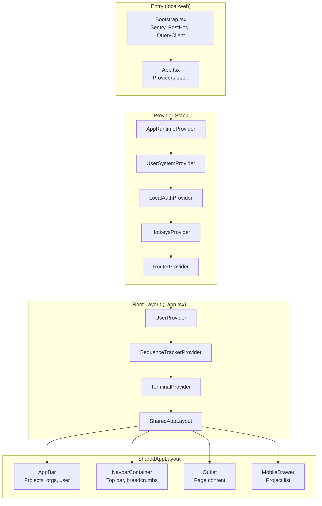
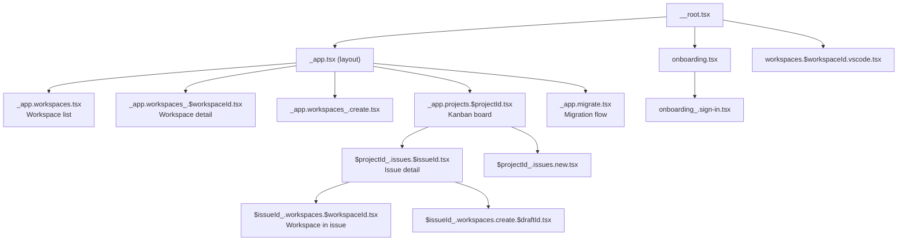
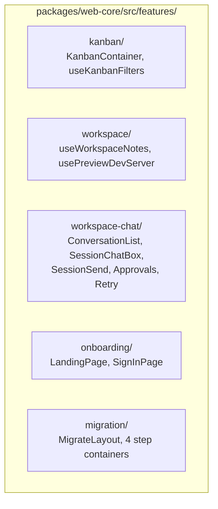

# Component Map

## Application Shell



## Route Structure



## Feature Modules



## Workspace-Chat Feature (Core)

```mermaid
graph TB
    subgraph "workspace-chat/ui/"
        CONV_LIST["ConversationListContainer"]
        NEW_ENTRY["NewDisplayConversationEntry"]
        CHATBOX["SessionChatBoxContainer"]
    end

    subgraph "workspace-chat/model/hooks/"
        USE_SEND["useSessionSend"]
        USE_HIST["useConversationHistory"]
        USE_APPROVAL["useApprovalMutation"]
        USE_RETRY["useMessageEditRetry"]
        USE_RESET["useResetProcess"]
        USE_QUEUE["useSessionQueueInteraction"]
        USE_CREATE_S["useCreateSession"]
        USE_ATTACH["useSessionAttachments"]
        USE_EDITOR["useSessionMessageEditor"]
        USE_TODOS["useTodos"]
    end

    subgraph "workspace-chat/model/contexts/"
        CTX_ENTRIES["EntriesContext"]
        CTX_APPROVAL["ApprovalFeedbackContext"]
        CTX_EDIT["MessageEditContext"]
        CTX_RETRY["RetryUiContext"]
    end

    CHATBOX --> USE_SEND
    CHATBOX --> USE_EDITOR
    CONV_LIST --> USE_HIST
    CONV_LIST --> CTX_ENTRIES
```



## Zustand Stores

| Store | Key State | Persisted |
|-------|-----------|-----------|
| `useOrganizationStore` | selectedOrgId | Yes |
| `useUiPreferencesStore` | layoutMode, paneSizes, kanbanViewMode, workspaceFilters, mobileFontScale, collapsedPaths | Yes |
| `useDiffViewStore` | mode (unified/split), ignoreWhitespace, wrapText | Yes |
| `useExpandableStore` | expanded (key-value toggle) | No |
| `useInspectModeStore` | inspect mode for workspace-chat | No |

## Key Hooks by Category

### State & Context
- `useAuth()`, `useCurrentUser()`, `useAuthMutations()`
- `useWorkspaceContext()`, `useWorkspaces()`, `useWorkspaceSessions()`
- `useProjectContext()`, `useOrgContext()`
- `useIssueContext()`, `useIssueContextOptional()`

### Chat & Sessions
- `useSessionSend()` - send message to agent
- `useConversationHistory()` - load turns
- `useCreateSession()` - new agent session
- `useApprovals()` - approval flow
- `useTodos()` - task management

### Execution
- `useAttempt()`, `useTaskAttempts()` - workspace data
- `useExecutionProcesses()` - running processes
- `useRetryProcess()` - retry/reset execution

### Git
- `useGitOperations()`, `useBranchStatus()`
- `usePush()`, `useMerge()`, `useRebase()`, `useForcePush()`
- `useChangeTargetBranch()`, `useRenameBranch()`
- `useDiffStream()`, `useDiffSummary()`

### UI
- `useIsMobile()`, `useTheme()`
- `useKanbanNavigation()`, `useCommandBarShortcut()`
- `useTerminal()`, `useLogStream()`
- `useOpenInEditor()`

### Forms & Config
- `useCreateWorkspace()`, `useProjectWorkspaceCreateDraft()`
- `useExecutorConfig()`, `usePresetOptions()`, `useProfiles()`

## API Client (`shared/lib/api.ts`)

Organized by domain:
- `sessionsApi` - Session CRUD + follow-up
- `attemptsApi` - Workspace CRUD + git ops + PR
- `executionProcessesApi` - Process lifecycle
- `fileSystemApi` - Directory browsing
- `repoApi` - Repo registration + branches + search
- `configApi` - App config + MCP + profiles
- `tagsApi` - Tag management
- `imagesApi` - Image upload/serve
- `approvalsApi` - Approval responses
- `oauthApi` - Auth flow
- `organizationsApi` - Org CRUD + members
- `remoteProjectsApi` - Cloud project/issue/status
- `scratchApi` - Scratch pad CRUD
- `agentsApi` - Agent availability + discovery
- `queueApi` - Message queue
- `migrationApi` - Data migration
- `searchApi` - File search

## Design System

### CSS Variable Tokens

```
Text:       --text-high, --text-normal, --text-low
Background: --bg-primary, --bg-secondary, --bg-panel
Brand:      --brand (orange hsl(25 82% 54%)), --brand-hover, --brand-secondary
Status:     --error, --success, --merged
Border:     --separator-border, --focus-border
On-brand:   --text-on-brand
```

### Tailwind Extensions
- **Spacing**: `p-half` (6px), `p-base` (12px), `p-double` (24px)
- **Font sizes**: xs=8px, sm=10px, base=12px, lg=14px, xl=16px
- **Radius**: `--radius: 0.125rem` (small by default)
- **Focus**: `ring-brand` (orange), inset

### Component Library (@vibe/ui - 143 components)

**Chat**: ChatBoxBase, ChatAssistantMessage, ChatUserMessage, ChatThinkingMessage, ChatMarkdown, ChatToolSummary, ChatApprovalCard, ChatAggregatedDiffEntries

**Kanban**: KanbanBoard, KanbanCardContent, KanbanIssuePanel, KanbanFilterBar, IssueListView, IssueListSection

**Issues**: IssuePropertyRow, IssueCommentsSection, IssueRelationshipsSection, IssueSubIssuesSection, IssueTagsRow, IssueWorkspacesSection

**Forms**: Input, InputField, Textarea, Checkbox, Switch, Select, Toggle, Label

**Data**: DataTable, Badge, ProcessListItem, WorkspaceSummary, SubIssueRow

**Dropdowns**: Dropdown, DropdownMenu, SearchableDropdown, MultiSelectDropdown, CommandBar, TypeaheadMenu

**Dialogs**: Dialog, ConfirmDialog, DeleteWorkspaceDialog, CreateRepoDialog, GuideDialogShell

**File**: FileTree, FileTreeNode, RepoCard, GitPanel, ChangesPanel, DiffPanel

**Terminal**: TerminalPanel, PreviewBrowser, PreviewControls, ContextUsageGauge

**Icons**: StatusDot, PriorityIcon, PrBadge, RelationshipBadge, ToolStatusDot

**Buttons**: Button, PrimaryButton, SplitButton, IconButton, IconButtonGroup
