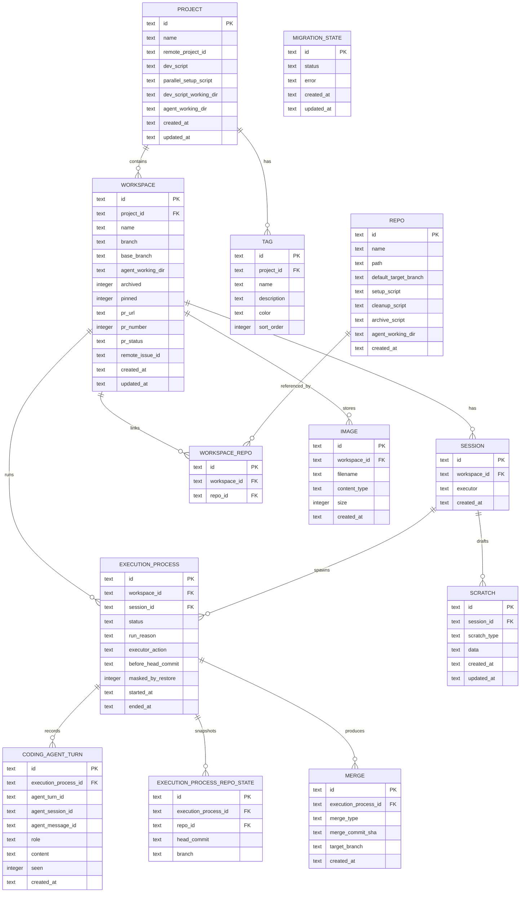
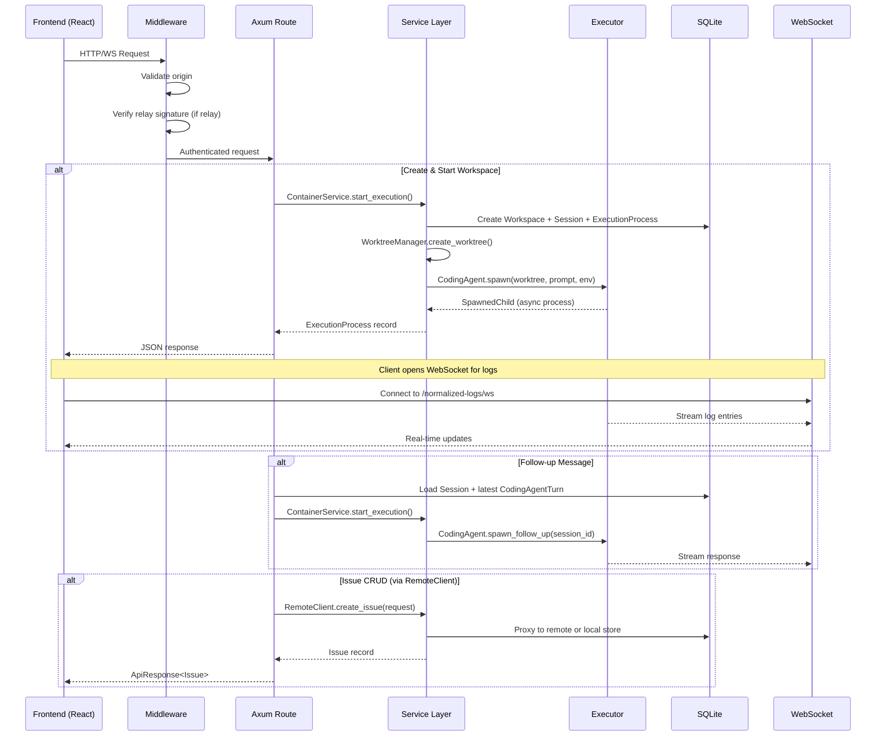
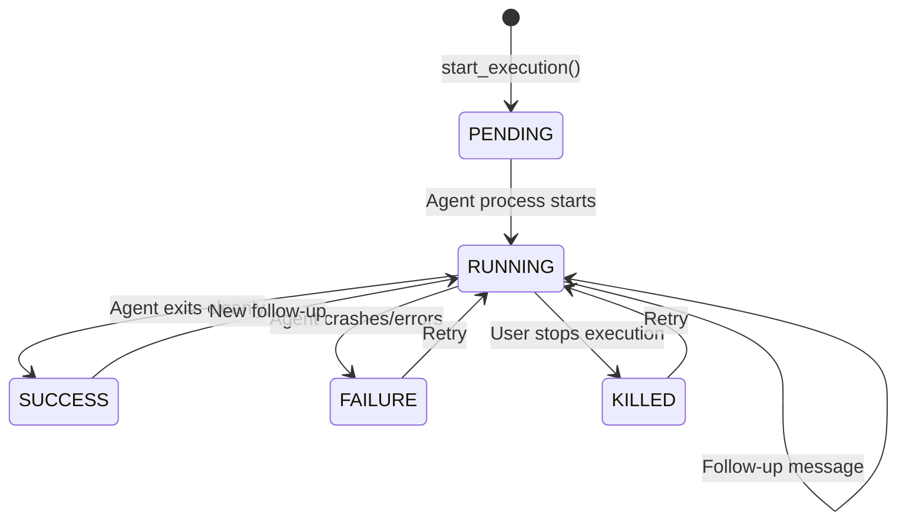

# Data Flow

## Database Schema

## API Routes

### Core CRUD

| Method | Path | Description |
|--------|------|-------------|
| GET | `/api/health` | Health check |
| GET/PUT | `/api/config` | App configuration |
| GET | `/api/config/info` | Server info |
| GET/POST | `/api/config/mcp-config` | MCP server config |
| GET/PUT | `/api/config/profiles` | Executor profiles |
| GET | `/api/config/agents/check-availability` | Agent installation status |
| GET | `/api/config/agents/preset-options` | Agent presets |

### Workspaces (Task Attempts)

| Method | Path | Description |
|--------|------|-------------|
| GET/POST | `/api/task-attempts` | List/create workspaces |
| POST | `/api/task-attempts/create-and-start` | Create workspace + start agent |
| POST | `/api/task-attempts/from-pr` | Create from pull request |
| PATCH/DELETE | `/api/task-attempts/{id}` | Update/delete workspace |
| POST | `/api/task-attempts/{id}/run-agent-setup` | Run setup script |
| POST | `/api/task-attempts/{id}/start-dev-server` | Start dev server |

### Git Operations

| Method | Path | Description |
|--------|------|-------------|
| GET | `/api/task-attempts/{id}/branch-status` | Branch divergence info |
| POST | `/api/task-attempts/{id}/merge` | Merge to target branch |
| POST | `/api/task-attempts/{id}/push` | Push branch |
| POST | `/api/task-attempts/{id}/push/force` | Force push |
| POST | `/api/task-attempts/{id}/rebase` | Rebase onto target |
| POST | `/api/task-attempts/{id}/rebase/continue` | Continue rebase |
| POST | `/api/task-attempts/{id}/conflicts/abort` | Abort conflict resolution |
| POST | `/api/task-attempts/{id}/change-target-branch` | Change merge target |
| POST | `/api/task-attempts/{id}/rename-branch` | Rename workspace branch |

### Pull Requests

| Method | Path | Description |
|--------|------|-------------|
| POST | `/api/task-attempts/{id}/pr` | Create PR |
| POST | `/api/task-attempts/{id}/pr/attach` | Attach existing PR |
| GET | `/api/task-attempts/{id}/pr/comments` | PR comments |

### Sessions & Execution

| Method | Path | Description |
|--------|------|-------------|
| GET/POST | `/api/sessions` | List/create agent sessions |
| GET | `/api/sessions/{id}` | Get session |
| POST | `/api/sessions/{id}/follow-up` | Send follow-up message to agent |
| POST | `/api/sessions/{id}/reset` | Reset to prior process state |
| POST | `/api/sessions/{id}/review` | Start code review |
| GET | `/api/execution-processes/{id}` | Get execution process |
| POST | `/api/execution-processes/{id}/stop` | Kill agent process |
| GET | `/api/execution-processes/{id}/repo-states` | Git state snapshots |

### Repos & Filesystem

| Method | Path | Description |
|--------|------|-------------|
| GET/POST | `/api/repos` | List/register repos |
| POST | `/api/repos/init` | Create new repo (git init) |
| GET | `/api/repos/recent` | Recently used repos |
| GET | `/api/repos/{id}/branches` | List branches |
| GET | `/api/repos/{id}/prs` | List PRs |
| GET | `/api/repos/{id}/search` | File search |
| GET | `/api/filesystem/directory` | Browse directory |
| GET | `/api/filesystem/git-repos` | Discover git repos in path |

### Remote API (Cloud Sync)

| Method | Path | Description |
|--------|------|-------------|
| GET/POST | `/api/remote/issues` | List/create issues |
| GET/PATCH/DELETE | `/api/remote/issues/{id}` | Issue CRUD |
| GET/POST | `/api/remote/issue-assignees` | Issue assignees |
| POST/DELETE | `/api/remote/issue-relationships` | Issue relationships |
| GET/POST | `/api/remote/issue-tags` | Issue tags |
| GET | `/api/remote/projects` | List projects |
| GET | `/api/remote/project-statuses` | Status columns |
| GET | `/api/remote/tags` | List tags |

### WebSocket Endpoints

| Path | Protocol | Description |
|------|----------|-------------|
| `/api/execution-processes/{id}/raw-logs/ws` | WS | Raw stdout/stderr stream |
| `/api/execution-processes/{id}/normalized-logs/ws` | WS | Parsed log entries stream |
| `/api/task-attempts/stream/ws` | WS | Workspace process list updates |
| `/api/task-attempts/{id}/diff/ws` | WS | Live git diff stream |
| `/api/approvals/stream/ws` | WS | Approval request stream |
| `/api/config/agents/discovered-options/ws` | WS | Agent discovery stream |
| `/api/scratch/{id}/stream/ws` | WS | Scratch data stream |
| `/ws/terminal` | WS | PTY terminal session |

### Other

| Method | Path | Description |
|--------|------|-------------|
| GET | `/api/events` | SSE event stream |
| GET | `/api/search` | Full-text file search |
| GET/POST | `/api/tags` | Tag CRUD |
| POST | `/api/approvals/{id}/respond` | Respond to approval |
| GET/POST/PUT/DELETE | `/api/scratch` | Scratch pad CRUD |
| GET/POST | `/api/organizations` | Organization management |
| POST | `/api/migration/start` | Start data migration |

## Request Lifecycle

## Execution Process State Machine

## MCP Tools (Exposed to Agents)

Agents connect to `mcp_task_server` via stdio and can:

| Tool | Description |
|------|-------------|
| `get_context` | Get current workspace/project/issue metadata |
| `list_workspaces` | List local workspaces (filter: archived, pinned, branch) |
| `update_workspace` | Update workspace state |
| `list_organizations` | List organizations |
| `list_projects` | List remote projects |
| `create_issue` | Create kanban issue |
| `list_issues` | Query issues (filter: status, priority, assignee, tag) |
| `get_issue` / `update_issue` / `delete_issue` | Issue CRUD |
| `list_issue_priorities` | Get priority enum values |
| `assign_user` / `remove_assignee` | Issue assignment |
| `create_tag` / `attach_tag` / `remove_tag` | Tag management |
| `create_relationship` / `delete_relationship` | Issue linking |
| `list_repositories` / `get_repository` | Repo info |
| `search_files` | File search within repo |
| `start_workspace_session` | Create and start a new workspace |
| `link_workspace` | Link workspace to issue |
